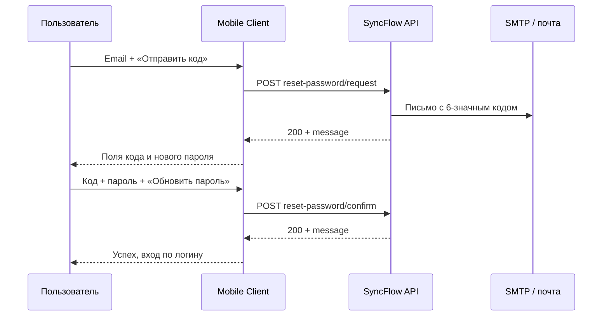

# RestaurantN Mobile Client (дипломный проект)

Мобильное **клиентское** приложение гостя ресторана на **React Native + Expo** с интеграцией в REST API **SyncFlow** (описание контракта — `API_DOCS.md` в корне репозитория).  
Репозиторий оформлен как демонстрация white-label продукта на примере бренда **RestaurantN**.

---

## 1. Назначение проекта

Приложение закрывает цифровой канал для гостя:

| Направление | Что делает приложение |
|-------------|------------------------|
| Меню | Просмотр позиций, фильтры, рекомендации, карточка блюда (состав, модификаторы). |
| Гость без входа | Только просмотр меню и карточек; заказ недоступен до авторизации. |
| Авторизация | Вход, регистрация, восстановление пароля (email + код). |
| Заказ | Корзина, промокод, бонусы, персональная скидка (если отдаёт сервер), оформление самовывоза. |
| Бронь | Выбор даты/времени/стола, предзаказ из корзины, отправка на API. |
| Лояльность | Баланс бонусов, история транзакций, списание при оплате заказа. |
| Профиль | Личные данные, XP/уровень (если есть в ответе API), избранное, история заказов и броней. |
| Уведомления | Список, непрочитанные, отметка прочитанным, «прочитать все», регистрация push-токена. |

### Идея для диплома (white-label)

- Ядро не привязано к одному ресторану: бренд, тексты, `expo.extra` и URL API перенастраиваются.
- В демо зафиксирован один бренд и один тестовый сервер SyncFlow.

---

## 2. Технологический стек

| Компонент | Технология |
|-----------|------------|
| UI | React 19, React Native 0.81, Expo SDK 54 |
| Навигация | `@react-navigation/native`, `@react-navigation/native-stack` |
| Состояние | React Context (`AuthContext`, `ClientDataContext`) |
| Персистентность | `@react-native-async-storage/async-storage` (кэш меню, корзина, пользовательский срез данных) |
| Медиа / UX | `expo-image`, `expo-linear-gradient`, `expo-blur`, `expo-notifications` |
| HTTP | Обёртка `syncflowHttp.js` (таймауты, разбор ошибок, refresh access token) |
| Тесты | Jest, `jest.setup.js` (моки Expo и AsyncStorage); unit-тесты контракта восстановления пароля |

Запуск тестов (при ошибках Watchman на macOS):

```bash
npm test -- --watchman=false
```

---

## 3. Архитектура

### 3.1 Слои

1. **Экраны и компоненты** — `src/screens/*`, `src/components/*`.
2. **Навигация** — `src/navigation/AppNavigator.js` (стек табов, оверлеи: блюдо, бронь, уведомления, история заказов/броней, гостевой режим).
3. **Сессия** — `src/contexts/AuthContext.js` (логин, токены в хранилище, при необходимости обновление пользователя после сохранения профиля).
4. **Данные приложения** — `ClientDataContext.js`:
   - загрузка и кэш: `useClientDataBootstrap.js`;
   - действия (корзина, заказы, бронь, промо, избранное, уведомления и т.д.): `useClientDataActions.js`;
   - константы и хелперы: `clientDataUtils.js`;
   - чтение/запись JSON в AsyncStorage: `clientDataStorage.js`.
5. **API** — фасад `src/services/api/clientApi.js` выбирает реализацию (mock / HTTP / SyncFlow) по `runtimeConfig`.
6. **SyncFlow** — `clientApi.syncflow.http.js` + нормализация ответов в `syncflowMappers.js`.

### 3.2 Рефакторинг (стабильность и структура)

- Вынесены мапперы DTO → клиентские модели в `syncflowMappers.js`.
- Контекст данных разделён на bootstrap, actions и утилиты (меньше монолита, проще сопровождать).
- Крупные экраны декомпозированы:
  - `ProfileScreen` → `src/screens/profile/*`
  - `BookingScreen` → `src/screens/booking/*`
  - `CartScreen` → `src/screens/cart/*`
  - `AuthScreen` → `src/screens/auth/*` (в т.ч. `PasswordRecoveryModal.js`, `RecoveryCodeInput.js`)
  - восстановление пароля → `usePasswordRecovery.js` + `constants/passwordRecovery.js`
- Навигация: синхронизация активного таба с фактическим маршрутом (`NavigationContainer.onStateChange`), сброс оверлеев после успешного входа.

---

## 4. Конфигурация и режимы backend

Источник правды для окружения: **`app.json` → `expo.extra`**, чтение в **`src/config/runtimeConfig.js`**.

| Параметр | Назначение |
|----------|------------|
| `integratedBackend` | `"syncflow"` — контракт из `API_DOCS.md`; иное значение — локальный Express из `/server` (если используется). |
| `apiBaseUrl` | Базовый URL API, для SyncFlow обычно `http://<хост>/api`. |
| `useMockApi` | Если `true`, часть сценариев идёт через `clientApi.mock.js` (в текущем `app.json` для демо стоит `false`). |
| `enablePremiumTabGestures` | Доп. жесты между табами (по умолчанию выключено). |
| `restaurantId` | Значение заголовка **`X-Restaurant-ID`** для мультиресторанного стенда SyncFlow (если пусто — поведение сервера по умолчанию). |

**Текущее демо (как в репозитории):**

- `integratedBackend`: `syncflow`
- `apiBaseUrl`: `http://186.246.5.94/api`
- `restaurantId`: `restaurant1`
- `useMockApi`: `false`

Заголовок **`X-Restaurant-ID`** передаётся автоматически из `restaurantId` в `syncflowHttp.js` (все публичные и guest-запросы, в том числе восстановление пароля).

---

## 5. Функциональность (детально)

### 5.1 Гостевой режим (без авторизации)

- Показывается **только меню** (и при открытии карточки — просмотр без кнопок заказа).
- **Нет нижнего таббара** основного приложения; доступен переход к экрану входа/регистрации.
- После авторизации открывается полный интерфейс с табами.

### 5.2 Авторизация и регистрация

- Переключение «Вход / Регистрация», валидация полей (логин, пароль; при регистрации — имя, фамилия, опционально email и телефон).
- **Вход и регистрация SyncFlow:** `POST /guest/auth/login`, `POST /guest/auth/register` (`authApi.syncflow.http.js`, `AuthScreen.js`).
- Email при регистрации **необязателен** (§2.2 `API_DOCS.md`), но **обязателен для сценария «Забыли пароль?»** — восстановление ищет гостя только по email из профиля.
- Ошибки бэкенда показываются через унифицированный разбор JSON в `syncflowHttp.js` (`toUserMessage`, статусы на объекте ошибки).

#### 5.2.1 Восстановление пароля (§2.6 `API_DOCS.md`)

Реализован двухшаговый сценарий **без авторизации**. Письмо и одноразовый код генерирует **только сервер** (SMTP); клиент не создаёт код и не отправляет email напрямую.

**Где в коде**

| Слой | Файл | Роль |
|------|------|------|
| Константы контракта | `src/constants/passwordRecovery.js` | 6 цифр кода, 15 мин TTL, мин. 6 символов пароля, `pickServerMessage()` |
| HTTP | `src/services/api/authApi.syncflow.http.js` | `requestPasswordRecovery`, `confirmPasswordRecovery` |
| Состояние и логика | `src/hooks/usePasswordRecovery.js` | Два шага UI, обработка ошибок, abort при закрытии модалки |
| UI | `src/screens/auth/PasswordRecoveryModal.js`, `RecoveryCodeInput.js` | Модалка, ввод 6-значного кода |
| Точка входа | `src/screens/AuthScreen.js` | Кнопка «Забыли пароль?» (только режим входа, не регистрация) |
| Прокси | `src/contexts/AuthContext.js` | Проброс вызовов в `authApi` |
| Тесты | `src/constants/passwordRecovery.test.js` | Сверка констант с документацией |

**Шаг 1 — запрос кода на почту**

| Документация | Клиент |
|--------------|--------|
| `POST /api/guest/auth/reset-password/request` | `syncflowPublicRequest('/guest/auth/reset-password/request')` |
| Тело `{ "email": "user@mail.ru" }` | `{ email }` после `normalizeEmailForApi()` |
| Ответ `200`: `{ "message": "Код отправлен на …" }` | Переход на шаг ввода кода **только после успешного HTTP 200**; текст успеха — из `message` сервера |
| Письмо: **6 цифр**, срок **15 минут** | Валидация и подсказки через `RECOVERY_CODE_LENGTH`, `RECOVERY_CODE_TTL_MINUTES` |
| `404` — email не найден | Сообщение пользователю, остаёмся на шаге email |
| `409` — ошибка SMTP | Сообщение о неполадке отправки письма |
| `400` — неверный формат email | Клиентская проверка + разбор ответа сервера |

Пока идёт запрос, показывается индикатор загрузки и подсказка «Ждём ответ сервера…». Таймаут запроса — **120 с** (`RECOVERY_TIMEOUT_MS`), без повторных автоматических retry (чтобы не дублировать отправку письма на SMTP).

**Шаг 2 — подтверждение кода и смена пароля**

| Документация | Клиент |
|--------------|--------|
| `POST /api/guest/auth/reset-password/confirm` | `syncflowPublicRequest('/guest/auth/reset-password/confirm')` |
| Тело `{ email, code, newPassword }` | Те же поля; `code` — строка из 6 цифр |
| `newPassword` ≥ 6 символов | Проверка до отправки + подтверждение пароля в UI |
| Ответ `200`: `{ "message": "Пароль успешно обновлён" }` | Успех, закрытие модалки, очистка полей пароля на экране входа |
| `401` — неверный/просроченный код | Подсказка запросить новый код |
| `404`, `400` | Отдельные тексты ошибок |

После смены пароля вход выполняется обычным способом: **`POST /guest/auth/login` по логину** (не по email), как указано в `API_DOCS.md`.

**Правила UX (важно для сопровождения)**

1. Поля кода и нового пароля **не показываются**, пока шаг 1 не завершился ответом `200` от сервера.
2. Нет ручного перехода «уже есть код» и нет автоперехода при таймауте сети.
3. На шаге ввода кода email **заблокирован** для редактирования (совпадает с тем, на который ушёл запрос).
4. «Отправить код повторно» снова вызывает шаг 1 и снова ждёт `200` перед продолжением.
5. Закрытие модалки или «Прервать» отменяет активный запрос (`AbortController`).

**Ограничения режимов**

- Работает только при `integratedBackend: "syncflow"` и `useMockApi: false`.
- Локальный backend (`authApi.local.http.js`) и mock **не** реализуют восстановление — будет сообщение «доступно только на интегрированном сервере».



### 5.3 Меню и карточка блюда

- Категории, поиск с debounce (напитки и прочие категории — в общем меню).
- **Рекомендации:** `GET /menu/recommended?limit=…` (публично, с fallback на авторизованный запрос при 401/403).
- **Состав и модификаторы** подгружаются с API; списки нормализуются (в т.ч. ответы в формате Spring `Page` с полем `content`).
- Цены на карточках: акцентный цвет читаемый на фоне (`primaryDark` при наличии).

### 5.4 Корзина и оформление заказа

- Количество позиций, модификаторы в цене строки.
- **Промокод:** проверка `POST /guest/promo/check`; после создания заказа на SyncFlow — **`POST /discounts/orders/{orderId}/promo`** (см. сценарий в `useCheckoutFlow.js`).
- **Персональная скидка гостя:**
  - В профиле отображаются **`discountPercentage`** и **`visitCount`** (если сервер отдаёт их в `GET /guest/profile`; поддерживаются несколько возможных имён полей для совместимости).
  - В корзине в блоке итогов **оценочно** учитывается процент **после** скидки промокода; лимит списания баллов считается от суммы после промо и персональной скидки (`src/utils/cart.js` — `buildCartPayableBreakdown`).
  - После создания заказа вызывается **`tryApplyGuestPersonalDiscount`**: при успешном `GET /discounts` ищется скидка с **`isGuestDiscount: true`** и выполняется **`POST /discounts/orders/{id}/apply/{discountId}`**. Если у роли гостя нет доступа к `/discounts`, вызов пропускается без падения приложения — финальная сумма всё равно определяется сервером при оплате.
- **Бонусы:** списание через `POST /bonus/my/spend` с привязкой к `orderId` после создания заказа.
- Сценарии: **самовывоз** или переход к **брони** с предзаказом.

### 5.5 Бронирование и предзаказ

- Свободные столы: `GET /tables/available` с датой, интервалом времени и числом мест.
- Создание брони: `POST /reservations` (имя и телефон из профиля; телефон нормализуется под формат с `+`).
- Предзаказ: `POST /reservations/{id}/preorder` для каждой позиции из корзины (`dishInCategoryId`, количество, примечание).

### 5.6 Заказы и оплата

- Создание: `POST /orders/my` с массивом `dishes` (`dishInCategoryId`, `quantity`, `modificatorIds`, `note`).
- Оплата: `PATCH /orders/my/{id}/pay` (на стороне сервера начисляются бонусы по правилам стенда).
- История заказов с подгрузкой порциями (пагинация на клиенте по `limit`/`offset`).

### 5.7 Профиль

- Чтение/обновление: `GET/PATCH /guest/profile` (в PATCH уходят только непустые строковые поля, телефон — как ожидает сервер).
- Баланс бонусов: `GET /bonus/my/balance`.
- **История бонусов:** `GET /bonus/my/transactions` — блок на экране профиля (последние записи).
- Отображение **персонального процента** и **учёта визитов/заказов**, если они приходят в профиле.
- Удаление аккаунта (если включено в API и UI).

### 5.8 Уведомления

- Список: `GET /notifications/my`.
- **Счётчик непрочитанных:** `GET /notifications/my/unread-count` — показывается в заголовке секции «Уведомления» на профиле (`notificationsUnreadCount` в контексте).
- **Отметка прочитанным:** `PATCH /notifications/{id}/read` при открытии уведомления из списка.
- **Прочитать все:** `PATCH /notifications/my/read-all` с экрана полного списка.
- Регистрация FCM: `POST /notifications/token`, при выходе — удаление токена (см. `AuthContext` / API-слой).

### 5.9 Избранное и отзывы

- Избранное: `GET/POST/DELETE /guest/favorites/{dishId}`.
- Отзыв после заказа: `POST /reviews` с `stars` и `description` (маппинг с экрана истории заказов).

### 5.10 Тема оформления

- Переключение светлой/тёмной темы через `ThemeContext`, палитра в `src/constants/theme.js`.

### 5.11 UI/UX: обоснование интерфейса (для пояснительной записки)

Интерфейс спроектирован под сценарий гостя «в зале / по пути»: быстрый просмотр меню, минимум касаний до оплаты, прозрачный расчёт суммы. Ниже — ключевые решения и зачем они сделаны (скриншоты прототипа — в `теория/figures/screenshots/` и п. 2.3 диплома).

| Решение | Реализация | Зачем гостю |
|--------|------------|-------------|
| Нижняя панель из 4 вкладок | Меню, корзина, бронь, профиль (`AppNavigator`) | Привычный паттерн food-приложений; бейдж на корзине напоминает о незавершённом заказе |
| Гостевой режим | Меню без входа; заказ — после auth | Можно оценить ассортимент до регистрации; ссылка «Вернуться к меню» на экране входа |
| Акцентный лайм `#C4E35A` | Цены, CTA «+», оплата, активный чип категории | Визуально ведёт к действиям с ценностью для ресторана |
| Карточки блюд | Фото, объём, цена, избранное, круглая кнопка «+» | Сканирование списка; добавление в корзину одним касанием в зоне большого пальца |
| Поиск с debounce | `MenuScreen`, ~300 мс | Меньше запросов к API и «дрожания» списка при наборе |
| Корзина + степпер | `CartScreen`, компоненты в `screens/cart/` | Быстрая правка количества без удаления позиции |
| Экран оплаты | `useCheckoutFlow`, промо, бонусы, способ получения | Все скидки и итог на одном экране; строки «промокод / баллы / к оплате» даже при нуле — доверие к расчёту |
| Бронь + предзаказ | `BookingScreen`, отдельное время подачи | Гость может прийти раньше; кухня получает целевое время подачи |
| Профиль и лояльность | Баланс, правила «1 балл = 1 ₽», история транзакций | Прозрачность программы; визиты учитываются на сервере после оплаты |
| Светлая / тёмная тема | `theme.js` → `getColors(isDarkMode)` | Комфорт при разном освещении; единые токены для white-label |

**Визуальный язык:** палитра лайм + лиловый (`BRAND_LIME`, `BRAND_LILAC`), шрифт DM Sans (кириллица), скругления карточек и «стеклянные» панели (`getGlassTokens`) — без тяжёлых контуров, чтобы интерфейс не перегружал гостя в условиях зала.

**Состояния UI:** загрузка, пустой список, ошибка с повтором; кэш меню/профиля в AsyncStorage при слабой сети. Push открывает целевой экран (бронь, профиль) в согласовании с табами.

**Ограничение для демо:** итог «К оплате» на клиенте — оценка по правилам UI; финальную сумму подтверждает сервер при оформлении заказа (см. §9).

---

## 6. Интеграция с API (ориентир)

Полный перечень методов, коды ошибок и примеры тел — в **`API_DOCS.md`**.  
На клиенте реализованы типовые **гостевые** сценарии; админские/сотрудничьи разделы документа в приложении не отображаются.

Важные технические моменты:

- **Ошибки:** не подменять текст 5xx на безликое сообщение — показывать текст сервера и при необходимости код `(HTTP …)`; в dev логируются детали запроса.
- **Refresh:** при `401` на guest-запросах выполняется обновление access token и повтор запроса.
- **Кэш:** меню, столы, срез «брони/заказы/профиль/избранное/уведомления» сохраняются в AsyncStorage для быстрого старта и офлайн-чтения до обновления.
- **Стратегия API-вызовов:** чтение может идти с fallback на mock в общем фасаде; **мутации** (заказ, профиль, избранное, промо к заказу и т.д.) идут строго в выбранный backend без тихого переключения на mock — чтобы не плодить рассинхрон данных.

---

## 7. Структура каталогов (актуально)

```text
.
├── API_DOCS.md              # контракт SyncFlow (сервер)
├── app.json                 # extra: apiBaseUrl, integratedBackend, useMockApi
├── README.md
├── jest.config.js
├── jest.setup.js
├── src/
│   ├── navigation/
│   │   └── AppNavigator.js
│   ├── contexts/
│   │   ├── AuthContext.js
│   │   ├── ClientDataContext.js
│   │   ├── ThemeContext.js
│   │   ├── useClientDataBootstrap.js
│   │   ├── useClientDataActions.js
│   │   ├── clientDataUtils.js
│   │   └── clientDataStorage.js
│   ├── services/
│   │   ├── syncflowHttp.js
│   │   ├── authSessionStorage.js
│   │   ├── pushToken.js
│   │   └── api/
│   │       ├── clientApi.js          # фасад + mock/strict
│   │       ├── clientApi.http.js     # выбор syncflow | local
│   │       ├── clientApi.syncflow.http.js
│   │       ├── clientApi.local.http.js
│   │       ├── clientApi.mock.js
│   │       ├── authApi*.js
│   │       └── syncflowMappers.js
│   ├── screens/
│   │   ├── MenuScreen.js, CartScreen.js
│   │   ├── BookingScreen.js, ProfileScreen.js, AuthScreen.js
│   │   ├── DishDetailsScreen.js, NotificationsScreen.js
│   │   ├── OrdersHistoryScreen.js, BookingsHistoryScreen.js
│   │   ├── auth/, booking/, cart/, profile/
│   │   └── ...
│   ├── components/
│   ├── hooks/
│   │   ├── usePasswordRecovery.js   # «Забыли пароль?» (§2.6 API)
│   │   ├── useCheckoutFlow.js
│   │   ├── useToastManager.js
│   │   └── …
│   ├── constants/
│   │   ├── passwordRecovery.js      # контракт 6/15/6, pickServerMessage
│   │   └── theme.js
│   ├── utils/                 # cart, inputMasks, bookingMap, …
│   └── config/
│       └── runtimeConfig.js
└── server/                    # локальный демо-backend (при integratedBackend !== syncflow)
```

---

## 8. Запуск

```bash
npm install
npx expo start --clear
```

Для тестов:

```bash
npm test -- --watchman=false
```

В том числе: `src/constants/passwordRecovery.test.js` (константы и разбор `message` из ответа §2.6).

Учётные данные тестовых гостей и сотрудников приведены в **`API_DOCS.md`** (раздел «Тестовые учётные данные»).

**Проверка восстановления пароля вручную**

1. Зарегистрировать гостя с тем же email, который будете указывать при восстановлении.
2. На экране входа → «Забыли пароль?» → email → «Отправить код» → дождаться `200` (может занять до ~2 минут).
3. Ввести 6 цифр из письма (проверить «Спам»), новый пароль ≥ 6 символов → «Обновить пароль».
4. Войти по **логину** с новым паролем.

---

## 9. Ограничения демо-стенда

- Доступность и ответы конкретного IP зависят от сети и состояния сервера.
- Push в **Expo Go** ограничен; полный сценарий FCM обычно требует dev/production build.
- Итоговая сумма заказа на экране оплаты определяется **сервером**; клиентские «Итого» в корзине — **оценка** по правилам UI (промо, персональный %, баллы).
- Персональная скидка и счётчик визитов отображаются **только если** поля приходят в API профиля и настроены соответствующие сущности скидок на backend.
- Восстановление пароля: доставка письма и работа SMTP на стороне сервера; клиент ориентируется на HTTP-ответы `200` / `409` / `404` из §2.6.

---

## 10. Тезис для пояснительной записки

Разработан мобильный клиент ресторанной системы на React Native (Expo), интегрированный с REST API SyncFlow по документированному контракту. Архитектура модульная: разделены UI, навигация, управление сессией, загрузка и кэш данных, HTTP-транспорт и доменные мапперы. Реализованы сценарии гостя: просмотр меню без авторизации, регистрация и вход, **восстановление пароля по email с одноразовым 6-значным кодом (§2.6)**, корзина с промокодом и бонусами, учёт персональной скидки при поддержке сервера, бронирование с предзаказом, история заказов, профиль с бонусной историей, уведомления с учётом непрочитанных. Проведён рефакторинг для снижения связности кода и повышения устойчивости. Проект демонстрирует применимость white-label подхода и переносимость на другого заказчика через конфигурацию и смену API.

---

## 11. Презентация к защите

Файл: **`Презентация_клиентский_модуль_RestaurantN.pptx`** (оформление — шаблон «Бордо» из `примеры през/`).

| Слайд | Содержание |
|-------|------------|
| 1 | Цель и задачи (клиентский модуль MobileEmployee) |
| 2 | BPMN процесса гостя |
| 3 | Use Case |
| 4 | Структура приложения (RN / Expo) |
| 5 | Sequence — бронь и предзаказ |
| 6 | ТЭО: затраты, 400 ч, CAPEX, диаграмма Ганта |
| 7 | ТЭО: эффект, альтернативы, выводы |

Сборка:

```bash
cd MobileEmployee
PYTHONPATH="../.pylibs" python3 tools/build_defense_presentation.py
```

PNG в `presentation_assets/` — черновик; для защиты лучше экспортировать из `теория/диаграммы/*.drawio` в diagrams.net (белый фон, 200 %) и заменить картинки на слайдах 2–6.

---

## 12. Возможное развитие

- Полноценный production push (FCM/APNs) и обработка deep link из уведомлений.
- Явная передача `X-Restaurant-ID` из конфига для мультиресторана.
- E2E-тесты (Detox / Maestro) для сценария восстановления пароля и расширение unit-тестов мапперов и расчёта корзины.
- Явное требование email при регистрации (опционально в UI), если продуктово нужен только вход по восстановлению.
- Метрики и логирование на стороне клиента (без утечки PII).
